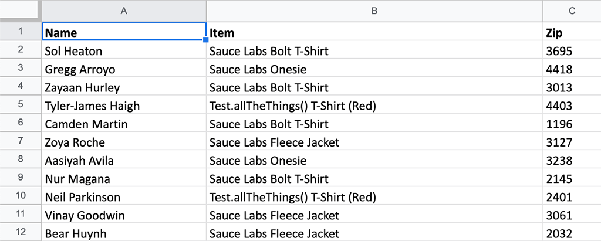

# Web store order processor example robot



This example robot orders swag from a [web store](https://www.saucedemo.com/) based on an Excel file. The robot uses credentials stored in a _vault_ file for logging into the store.

> Never commit sensitive information in your project. Provide the credentials for your robot from a vault file, environment variables, or with some other mechanism where the credentials are not exposed.

The robot will:

- open a real web browser and load the web store login page
- log into the web store using credentials provided using a vault file
- collect the orders from the provided Excel file using a custom Python library
- loop through the orders and complete the checkout for each order
- close the browser on process completion

> We have used this scenario as an example when explaining how to create a [Process Definition Document](/courses/implementing-rpa-robots/process-definition-document) for your RPA projects. Check it out!

This robot demonstrates some concepts and features of the Robot Framework and the RPA Framework:

- Using a vault for sensitive data such as credentials (`vault.json`, Control Room vault)
- Asserting task state (`Assert logged in`, `Assert item in cart`...)
- Resetting task state for the next item (`Reset application state`)
- Retrying keywords `n` times with a given delay (`Wait Until Keyword Succeeds`)
- Using a custom library (`Orders.py`)
- Using a third-party library in your own library (`from RPA.Excel.Files import Files`)
- Transforming Excel files to business entities, in this case, web store orders

## Setup

### Configure local vault (not recommended)

The robot is _almost_ ready to run, but still needs the vault for the credentials. See [how to use a vault for secrets](/development-guide/variables-and-secrets/vault) on how to set up the vault.

Paste this content in the vault file:

```json
{
  "swaglabs": {
    "username": "standard_user",
    "password": "secret_sauce"
  }
}
```

In [*devdata/env-local.json*](./devdata/env-local.json), edit the `RPA_SECRET_FILE`
variable to point to your *vault.json* file on your filesystem. On macOS / Linux,
use normal file paths (e.g.: `"/Users/<username>/vault.json"` or
`"/home/<username>/vault.json"`). On Windows, you need to escape the path:
`"C:\\Users\\User\\vault.json"`.

> Make sure you rename the *env-local.json* file into *env.json* if you want it picked
automatically by VSCode when the extension is not connected to the cloud, otherwise
the extension will be able to pick them up from Control Room's online Vault if
connected to the Workspace.

> Also set up the vault in Control Room, if you want to run the robot there.

### Control Room's online Vault (recommended)

Configure your Vault using the UI. The name of the vault should be `swaglabs`.
Provide the user name and the password as key-value pairs (see the vault file
for the exact naming).